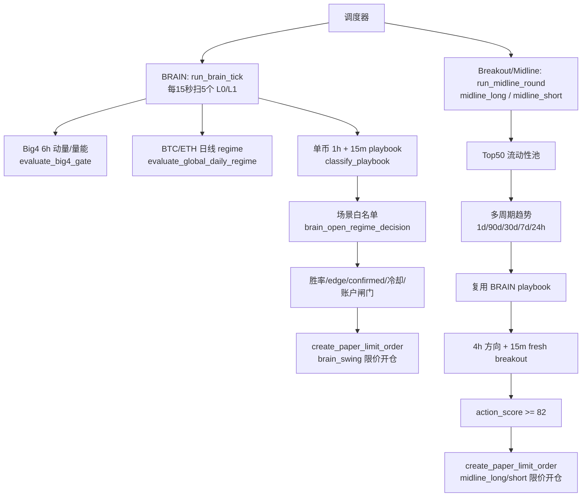
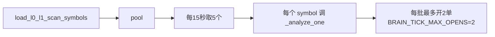
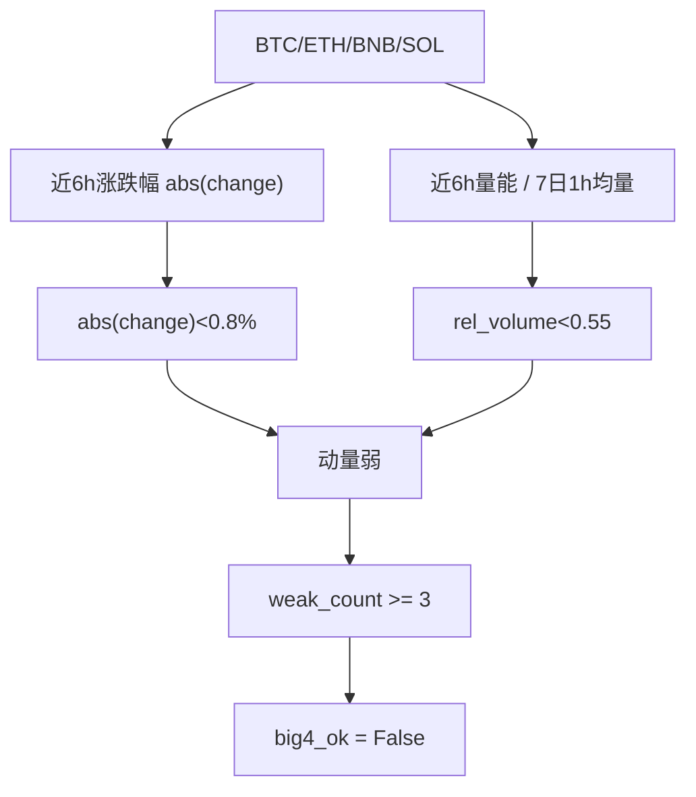
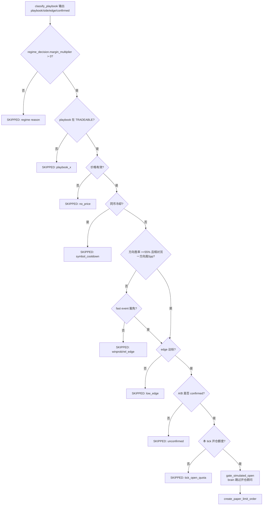
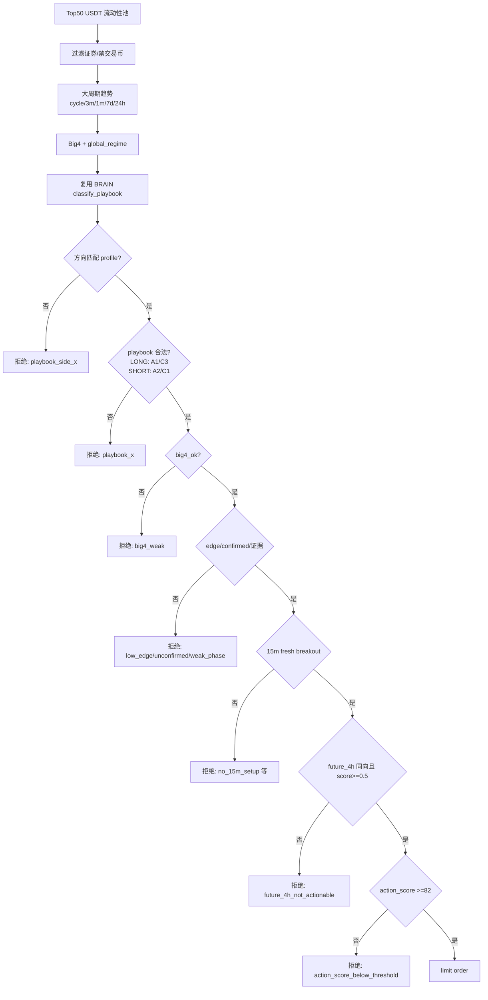
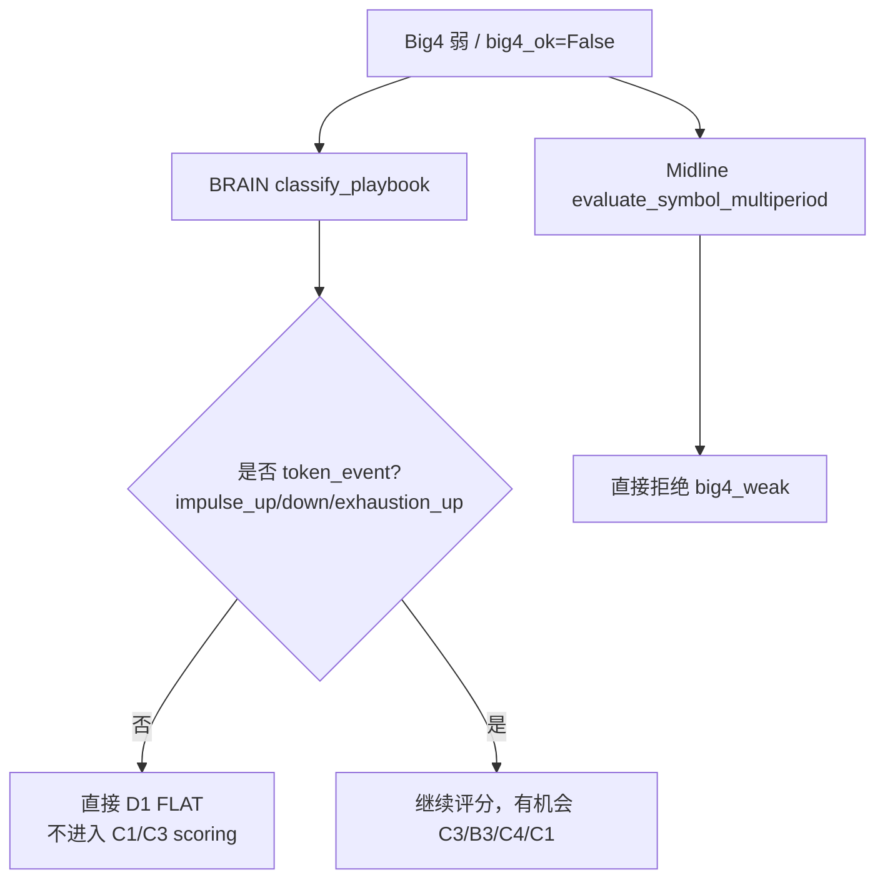
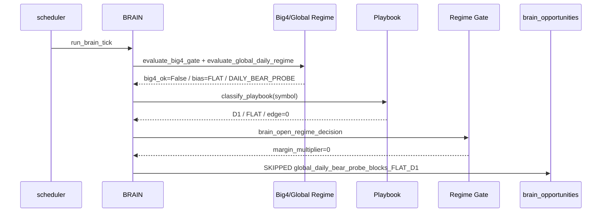
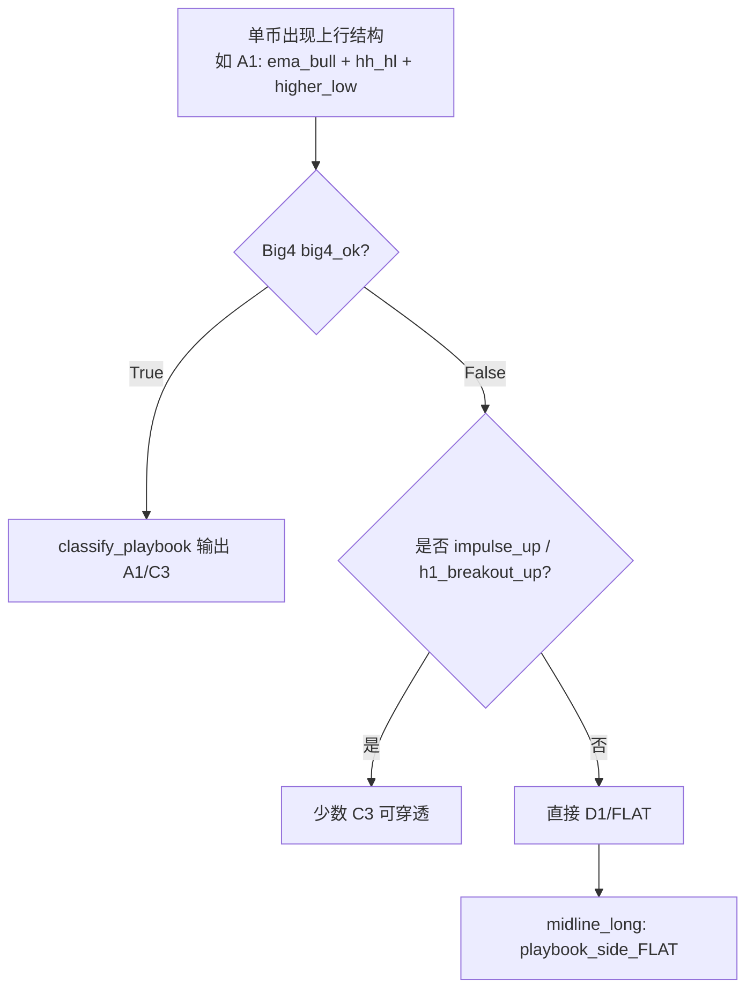

# 超级大脑与破位策略逻辑复查

复查日期：2026-08-16

主目标：盈利优先，抓住上行趋势和有效破位机会。保护逻辑应该过滤低质量噪音，但不能把强个币、强破位、放量突破也一起挡掉。

## 1. 总览图

## 2. 超级大脑 BRAIN 当前实现

主要文件：

- `app/services/brain_strategy_orchestrator.py`
- `app/services/brain_config.py`
- `app/services/brain_playbook.py`
- `app/services/brain_market_regime.py`
- `app/services/brain_winrate.py`
- `app/services/brain_risk_params.py`
- `app/services/brain_trail_exit.py`

### 2.1 扫描与候选池

BRAIN 入口是 `run_brain_tick`。每 15 秒扫一批，每批 5 个币，候选来自 L0/L1：

关键常量：

| 项目 | 当前值 | 含义 |
| --- | ---: | --- |
| `BRAIN_TICK_BATCH_SIZE` | 5 | 每轮分析 5 个币 |
| `BRAIN_TICK_INTERVAL_SECONDS` | 15 | 调度间隔 |
| `BRAIN_TICK_MAX_OPENS` | 2 | 单轮最多触发 2 个开仓 |
| `BRAIN_SYMBOL_OPEN_COOLDOWN_MINUTES` | 60 | 同币冷却 |
| `BRAIN_MARGIN_USD` | 500 | 默认保证金，实际可被币种设置覆盖 |
| `BRAIN_USE_MARKET_ENTRY` | False | 强制限价，防插针 |

### 2.2 Big4 与日线大环境

Big4 由 BTC/ETH/BNB/SOL 的近 6 根 1h 动量和相对成交量判断：

日线 regime 主要看 BTC 90 日位置、30/90 日涨跌、EMA20/60、ETH 是否确认弱势。`DAILY_BEAR_PROBE` 会显著收缩开仓。

### 2.3 Playbook 分类

BRAIN 从 1h 和 15m K 线抽取信号，再打 playbook：

| Playbook | 方向 | 当前开仓状态 | 触发要点 |
| --- | --- | --- | --- |
| A1 | LONG | 可开 | 多头趋势回踩 |
| A2 | SHORT | 只影子 | 空头趋势反抽，2026-08-14 后不实开 |
| B3 | SHORT | 可小仓 | 暴涨滞涨/上影/量价背离 |
| C1 | SHORT | 可小仓 | 向下破位，需支撑破位/放量/急跌确认 |
| C3 | LONG | 可小仓 | 向上突破，需放量或 1h impulse |
| C4 | SHORT | 可小仓 | 假突破陷阱 |
| D1/D2 | FLAT | 不开 | 震荡无边/冲突 |

当前 `TRADEABLE_PLAYBOOKS = {"A1", "B3", "C1", "C3", "C4"}`。

### 2.4 BRAIN 开仓闸门链

### 2.5 场景白名单重点

`brain_open_regime_decision` 是最核心的保护层。

| 场景 | 允许方向 | 允许 playbook | 仓位倍率 |
| --- | --- | --- | ---: |
| BULL_TREND | LONG | A1, 强 C3 | A1 1.0x, C3 0.5x |
| BEAR_TREND | SHORT | C1, B3/C4 | 0.35x |
| CRASH_DOWN | SHORT | 强 C1 | 0.25x |
| RANGE_CHOP | LONG/SHORT | 高 edge A1/C3/B3/C4 | 0.25-0.35x |
| TOKEN_DIVERGENCE | LONG/SHORT | 强单币 A1/C3/C1/B3/C4 | 0.25-0.5x |
| TRANSITION | LONG | 极强 A1 | 0.25x |
| DAILY_BEAR_PROBE | LONG/SHORT | 强 C3、强 C1、B3/C4 | 0.25-0.5x |
| LOW_VOL_NO_TRADE | 无 | 全挡 | 0 |

## 3. 破位 / Midline 当前实现

主要文件：

- `app/services/midline_swing_scanner.py`
- `app/services/midline_explore_worker.py`
- `app/services/midline_swing_config.py`

这个模块现在更像“Top50 高置信 4h 破位机会扫描器”，只是沿用了 `midline_*` source 和表名。

### 3.1 破位扫描链

### 3.2 15m fresh breakout 条件

| 条件 | LONG C3 | SHORT C1 |
| --- | --- | --- |
| 突破位 | last > 前 32 根区间高点 +0.15% | last < 前 32 根区间低点 -0.15% |
| 动量 | 1h >= +0.45% 或 4h >= +0.80% | 1h <= -0.45% 或 4h <= -0.80% |
| 量能 | 近 4 根量 / 前 12 根量 >= 1.12，或强破位 | 同左 |
| 区间宽度 | 0.35%-4.80% | 同左 |
| 过度延伸 | 4h 绝对波动 <=4.50%，除非强破位 | 同左 |

### 3.3 Midline 下单与退出

| 项目 | 当前值 |
| --- | ---: |
| source | `midline_long` / `midline_short` |
| 杠杆 | 5x |
| 保证金 | 500U 或币种配置 |
| 限价偏移 | LONG -1%, SHORT +1% |
| SL / TP | SL 6%, TP 3% |
| 持仓 | 8h |
| 开仓顾问 | 跳过 |
| 实盘同步 | 不进入 LIVE_SYNC |
| 移动止盈 | 走 `ai-trail-tp` |

## 4. 与盈利目标相关的关键观察

### 4.1 保护逻辑正常，但有过度收缩风险

今天没开单是保护生效，但从“抓上行/破位盈利”的主目标看，当前实现有两处偏保守：

影响：

- BRAIN 的 regime 层写了 `DAILY_BEAR_PROBE` 下允许强 C1/C3，但 playbook 分类层在 `big4_ok=False 且没有 token_event` 时会提前返回 D1。
- C1 向下破位如果只是 `break_support + volume_expand_down`，但未达到 `impulse_down`，可能还没到 regime 层就被 D1 吃掉。
- Midline 更硬：`big4_ok=False` 直接拒绝，不给强个币 C1/C3 豁免。

### 4.2 C3 上行突破有通道，但很窄

BRAIN 对 C3 有 fast-event 胜率放宽：

- `playbook == C3`
- signals 含 `impulse_up` 或 `h1_breakout_up`
- 如果方向胜率不是极差，可放过普通胜率闸门

但 C3 仍受：

- Big4/日线 regime
- confirmed
- edge
- 冷却
- 限价偏移
- 账户/币种闸门

这能防噪音，但也可能在快速主升段因为限价回踩不成交。

### 4.3 C1 下破位没有 fast-event 胜率放宽

`_fast_event_winprob_allowed` 放宽了：

- LONG C3
- SHORT B3/C4

没有放宽 SHORT C1。也就是说 C1 即使是 fresh breakdown，也仍要过方向胜率 `>=55%` 和相对优势 `>=5pp`。如果 7 日池子胜率滞后，可能会错过主跌破位。

### 4.4 A2 文档与实现已分叉

`brain_config.py` 注释说明 2026-08-14 复盘后 A2 亏损拖累，所以 A2 只打标不实开。`brain_open_regime_decision` 也一开始就让 A2 `shadow_only`。

旧文档仍有“A2/C1 受控补空”的表述，需要更新，否则后续判断会混乱。

### 4.5 校验脚本有滞后

`scripts/validate_brain_req.py` 前面检查“不应再有 `_strong_token_short_override`”，后面又 import 它，导致脚本失败。这不是策略运行失败，但说明验证体系没有完全跟上代码演进。

## 5. 今日无单的代码级解释

今天看到的 `global_daily_bear_probe_blocks_FLAT_D1` 对应链路是：

这说明系统没有坏；但它也说明强机会必须满足更极端的 token_event，否则会被统一归为 D1。

## 6. 建议的改进方向

### P1：让强破位先分类，再决定是否挡

当前 `classify_playbook` 在 `big4_ok=False` 时过早返回 D1。建议改成：

- 如果 `big4_ok=False`，普通 A1/A2/B1/B2 仍可提前 D1。
- 但 `break_support + volume_expand_down`、`break_resistance + volume_expand_up`、`h1_breakout_up/down`、`impulse_up/down` 应允许进入 scoring。
- 最终是否开单仍交给 `brain_open_regime_decision`，不要在分类层提前抹掉 C1/C3。

### P1：Midline 对强个币破位增加豁免

当前 Midline 在 `big4_ok=False` 直接 `big4_weak`。建议改成：

- Big4 弱时，普通趋势单不开。
- 但 C3 强上破、C1 强下破，如果 `future_4h` 同向、15m fresh breakout、action_score 达标，可以小仓或只挂更保守限价。

### P2：给 C1 增加 fast-event 胜率放宽

参考 C3 逻辑，C1 可在以下条件下绕过 stale winrate：

- `playbook == C1`
- `signals` 含 `break_support` 且 `volume_expand_down` 或 `crash_spike`
- `future_4h.side == SHORT`
- 不允许 winrate 极差，例如 short win_prob < 0.45 且 long 明显更高仍拒绝

### P2：文档和验证脚本同步

- 更新旧文档中“A2/C1 受控补空”的表述为“A2 只影子，C1 小仓试点”。
- 修复 `validate_brain_req.py` 中 `_strong_token_short_override` 的旧引用。

### P3：把“保护是否错过利润”量化

新增报表：

- 统计被 `global_daily_bear_probe_blocks_*` 拦截的 symbol 后 1h/4h/8h 最大顺向收益。
- 分 playbook 统计 D1 拦截后是否实际出现 C1/C3。
- 对比 BRAIN 与 Midline 在同一 symbol 上谁先发现，谁错过。

## 7. 一句话结论

当前实现不是失效，而是偏防守。它能避免震荡和弱 Big4 下乱开单，但对“强个币上行突破”和“弱市中的有效破位”存在提前拦截风险。要更贴近盈利目标，关键不是放松所有保护，而是给 C1/C3 这种强破位事件保留穿透通道，并用小仓、限价、短持仓、快速 trail 控制风险。

## 8. 2026-08-16 追加诊断：上行机会为什么没被发现

用户反馈：“破位策略感觉很费，没有找到最近的可能破位机会、上行机会。”追加只读诊断后，结论更明确：近 24h `midline_long` 没有进入细节评分层，主要卡在 playbook 第一层。

### 8.1 最近 24h verdict 分布

| source | 主要拒绝原因 | 数量 |
| --- | --- | ---: |
| `midline_long` | `playbook_side_FLAT` | 4700 |
| `midline_short` | `playbook_side_FLAT` | 3600 |

这说明破位策略大部分时间没有走到 `future_4h`、`fresh_breakout`、`action_score`，而是在 `classify_playbook` 输出 `D1/FLAT` 后直接退出。

### 8.2 典型上行样本

用同一批 K 线分别模拟 `big4_ok=True` 和 `big4_ok=False`：

| symbol | `big4_ok=True` 分类 | `big4_ok=False` 分类 | 观察 |
| --- | --- | --- | --- |
| `LDO/USDT` | `A1 LONG edge=0.90 confirmed=True` | `D1 FLAT` | 强趋势回踩/上行结构被 Big4 弱势提前抹掉 |
| `BERA/USDT` | `A1 LONG edge=1.00 confirmed=True` | `D1 FLAT` | 同上 |
| `BSB/USDT` | `C3 LONG edge=1.00 confirmed=True` | `C3 LONG` | 只有 `impulse_up` 这类极强事件能穿透 |
| `RARE/USDT` | `D1 FLAT`，但 `h1_side=LONG/m15_side=LONG` | `D1 FLAT` | 有上行倾向，但不是当前 C3/A1 定义 |
| `AAVE/USDT` | `B1 LONG edge=0.55 unconfirmed` | `D1 FLAT` | 反弹早期被挡，未达到可交易 |

核心证据：并不是没有任何上行形态；而是当前逻辑要求 Big4 可交易，或者单币必须强到 `impulse_up/h1_breakout_up`，否则会在 playbook 层变成 FLAT。

### 8.3 当前漏检模式

### 8.4 结论更新

破位/上行策略确实偏“费”：它现在不是在寻找“可能破位”，而是在等待“已经很强、并且 Big4 不弱、并且 15m/4h 全部确认”的机会。这样能减少噪音，但会错过上行早段和强个币先于大盘启动的阶段。

更贴近盈利目标的修改方向：

- 在 `big4_ok=False` 时，不要把强 A1/C3 候选直接归零；允许进入 watch/小仓候选层。
- Midline 增加“near breakout watchlist”：即使不下单，也要展示 `future_4h=LONG` 且 `h1_side/m15_side=LONG` 的上行候选。
- C3 继续保持最强穿透；A1 可在 `TOKEN_DIVERGENCE` 下小仓观察，而不是直接 D1。
